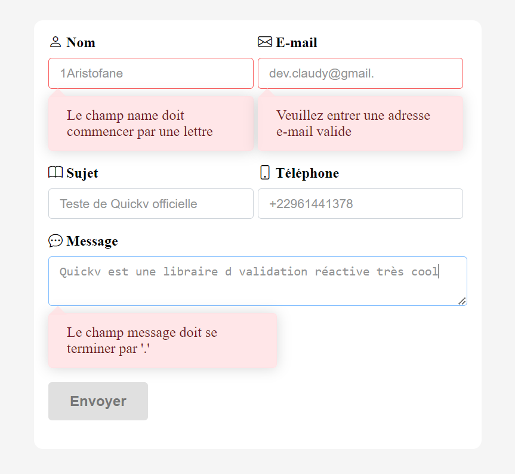
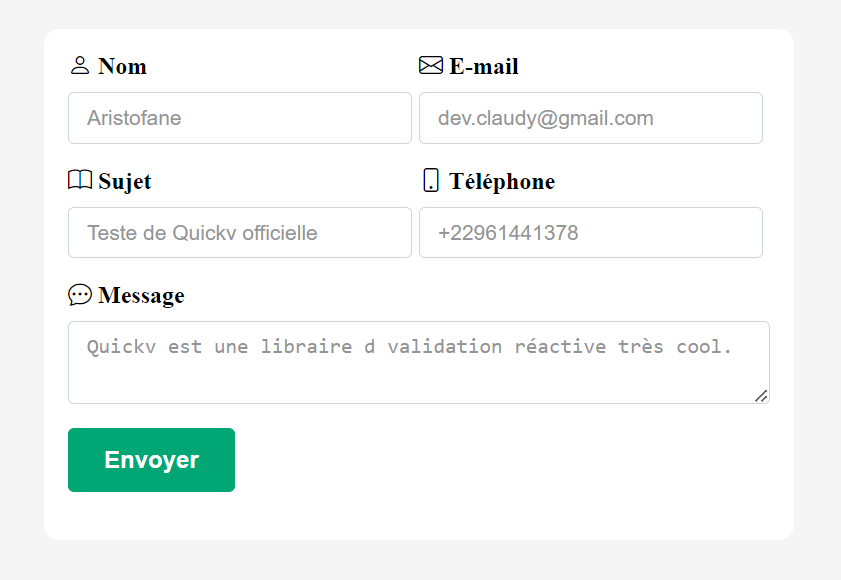

# Quickv validation
Passez-vous des heures à valider des formulaires ? Vous détestez écrire du code JavaScript ? Si c'est le cas, Quickv est fait pour vous !

[Quickv](https://github.com/quick-v/quickv) est un nouvel outil qui vous aide à valider les formulaires en un temps record. Il est facile à utiliser et ne nécessite pas de code JavaScript. Il suffit de créer un formulaire, d'ajouter les règles de validation Quickv et le tour est joué !
## Documentation
Voici le lien du tutoriel que j'ai suivi en moins de 5min pour pouvoir réaliser cette validation
[Suivre le tuto](https://quickv.vercel.app/docs/tutorial)

## Capture d'écran
Formulaire invalide:

Formulaire valide:

## Me suivre
[LinkedIn](https://www.linkedin.com/in/claude-fassinou-5745361ab/)
[Facebook](https://web.facebook.com/claudy.web.927/)
[Twitter](https://twitter.com/devclaudy)
